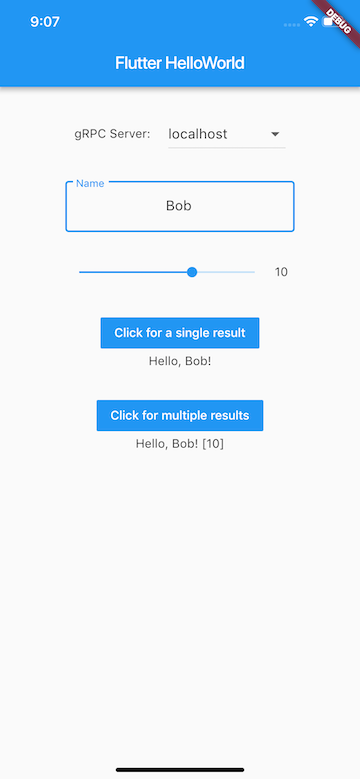

# Flutter Hello World

A simple Flutter project that uses [gRPC](https://grpc.io) for server communications.

## Getting Started

Build the gRPC stubs with: `make stubs`

Run the server locally with: `dart lib/server.dart`

Run the server via docker with: `docker run -p 50051:50051 -d pambrose/flutter_helloworld:0.1.0`

Build a docker image with `make build-docker`

Push a docker image with `make push-docker`

## Screenshot

